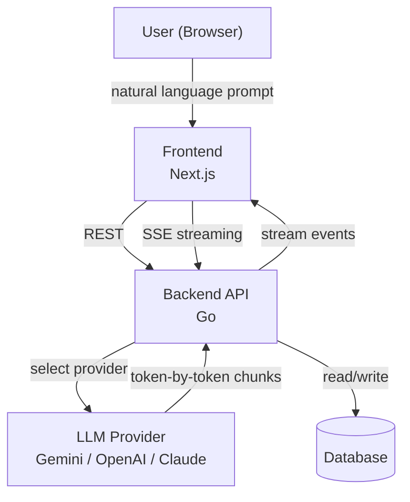
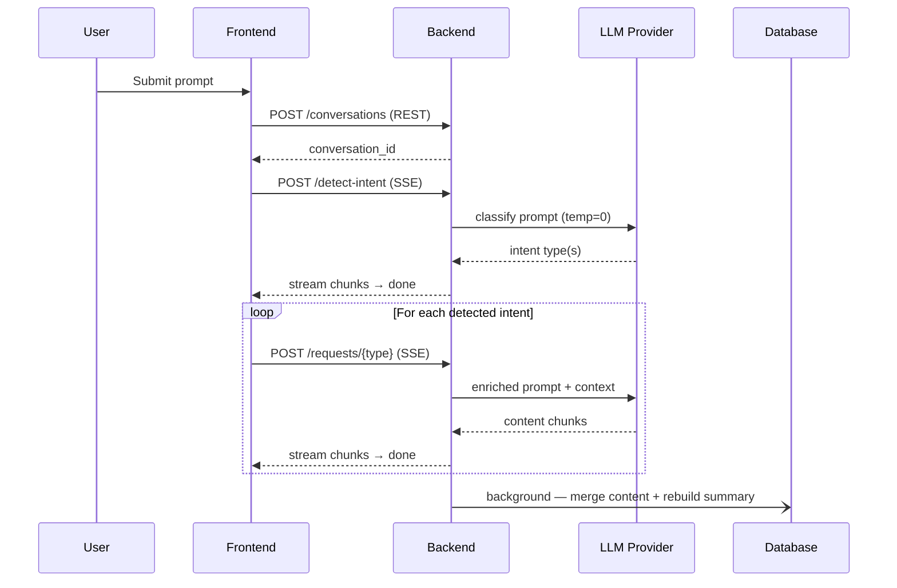
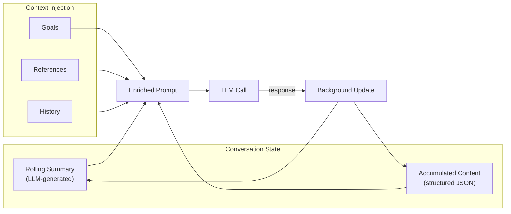
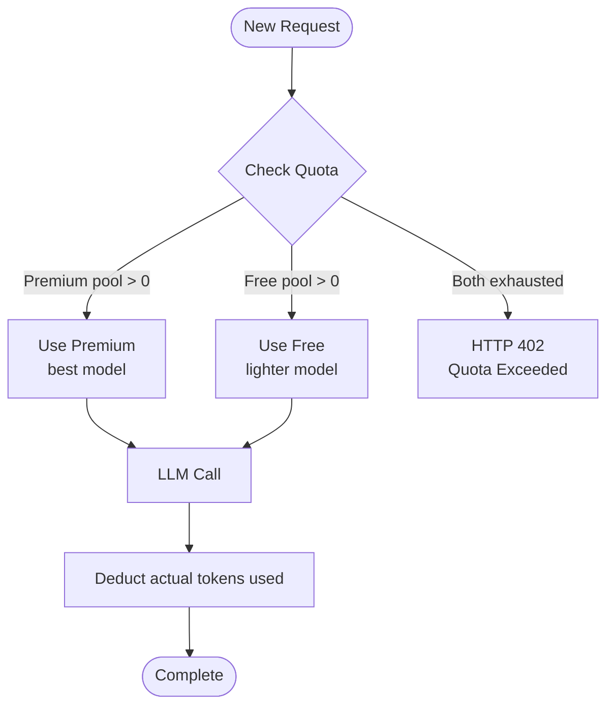

# System Overview — Agentic AI Content Generation Platform

### What it is

A web-based platform that enables users to generate and manage structured content through natural language conversation. It combines real-time LLM streaming, automatic intent routing, and persistent conversation memory into a unified workflow.

---

### High-Level Architecture

---

### Request Pipeline

---

### Memory Model

---

### Token Quota Flow

---

### Why Agentic, Not a Full Agent

| Characteristic | Present |
|---|---|
| LLM-driven intent classification | ✅ |
| Multi-tool dispatch from one prompt | ✅ |
| Persistent cross-session memory | ✅ |
| Autonomous background post-processing | ✅ |
| Self-evaluating ReAct loop | ❌ |
| Autonomous planning without user input | ❌ |

The system operates as a **human-in-the-loop agentic pipeline** — each execution is triggered by a user turn and routes through multiple LLM calls automatically, but does not self-direct toward open-ended goals without human involvement.
